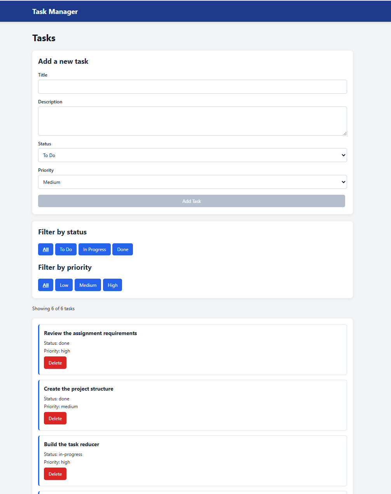
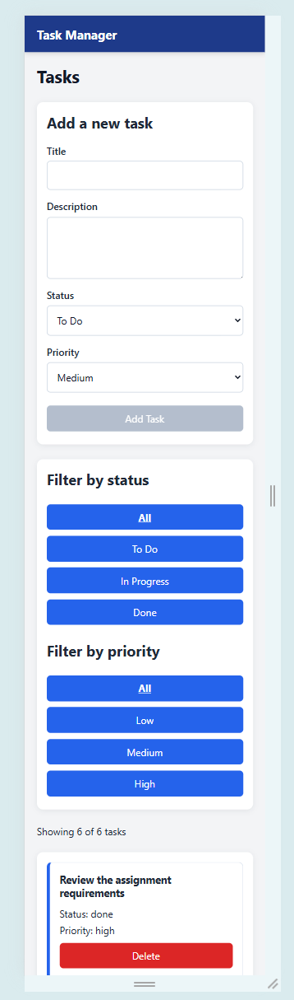

# Task Manager

A React Task Manager application created for the Module 2 Frontend Development assignment.

The application allows users to add, view, filter, edit, delete, and reorder tasks. Task information is saved in the browser so that changes remain after the page is refreshed.

## Features

### Task management

- Display an initial list of six tasks
- Add new tasks using a controlled form
- View the full details of an individual task
- Edit an existing task
- Delete a task with a confirmation message
- Reorder tasks using native browser drag-and-drop
- Save task changes in localStorage

### Task information

Each task contains:

- ID
- Title
- Description
- Status
- Priority

Available status values:

- To Do
- In Progress
- Done

Available priority values:

- Low
- Medium
- High

### Filtering

Tasks can be filtered by:

- Status
- Priority

The status and priority filters work together.

The application also displays:

````text
Showing X of Y tasks

Form validation

The Add Task button remains disabled until the required title and description fields are completed.

Routing

The application includes the following routes:

| Route        | Purpose                          |
| ------------ | -------------------------------- |
| `/`          | Redirects to `/tasks`            |
| `/tasks`     | Displays the task list           |
| `/tasks/:id` | Displays the details of one task |

An invalid task ID displays:
Task not found

Technologies Used
- React
- JavaScript
- Vite
- React Router
- Context API
- useReducer
- localStorage
- HTML5 native drag-and-drop
- CSS
- State Management

The application uses React Context and useReducer to manage and share task information.

The reducer supports the following actions:

- ADD_TASK
- DELETE_TASK
- UPDATE_TASK
- SET_FILTER
- SET_PRIORITY_FILTER
- REORDER_TASKS

The filtered task list is calculated from the full task list and the selected filters. It is not stored as separate state.


Project Structure
src/
├── components/
│   ├── Header.jsx
│   ├── FilterBar.jsx
│   ├── AddTaskForm.jsx
│   ├── TaskList.jsx
│   ├── TaskItem.jsx
│   └── EditTaskForm.jsx
├── context/
│   └── TaskContext.jsx
├── data/
│   └── initialTasks.js
├── pages/
│   ├── TaskListPage.jsx
│   └── TaskDetailPage.jsx
├── reducer/
│   └── taskReducer.js
├── App.jsx
├── App.css
├── index.css
└── main.jsx

## How to Run the Project

### 1. Install the dependencies

```bash
npm install
````

### 2. Start the development server

```bash
npm run dev
```

Open the local address shown in the terminal, such as:

```text
http://localhost:5173/
```

Vite may use another port if port 5173 is already occupied.

### 3. Create a production build

```bash
npm run build
```

### 4. Preview the production build

```bash
npm run preview
```

Open the preview address shown in the terminal.

## Data Storage

Tasks are stored in the browser using `localStorage`.

This means that added, edited, deleted, and reordered tasks remain after refreshing or reopening the application in the same browser.

To restore the original six tasks, remove the following localStorage item:

```text
task-manager-tasks
```

## Responsive Design

The application is designed to work on desktop, tablet, and mobile screen sizes.

## Screenshots

### Desktop View



### Mobile View



## AI Tool Usage

ChatGPT was used to support the development of this project.

It was used for:

- Explaining the assignment requirements
- Planning the project structure and development steps
- Generating and reviewing React code
- Explaining code in plain language
- Troubleshooting errors
- Reviewing application features and testing steps

All code was reviewed, tested, and understood by the student before submission.
